## Please use at your own risk. This a submission for bounty, not production/battle-tested and audited software.

<br>

# __AmsterDOT Acala Bounties Cross-Parachain Dapp__

<br>


<br>

## Table of Contents
1. [General Info](#general-info)
2. [Website](#website)
3. [Demo Video](#demo-video)
4. [Installation](#installation)
5. [Using the Front End](#using-the-front-end)
    * [Use XCM to Make a Cross Chain Transfer](#use-xcm-to-make-a-cross-chaon-transfer)
    * [Use XCM to Autostake KSM on Karura](#use-xcm-to-autostake-ksm-on-karura)
    * [Unstake KSM from LKSM on Karura](#unstake-ksm-from-lksm-on-karura)

<br>

## General Info
***
<p>This repo contains a DApp that allows the user to perform XCM operations across the Kusama mainnet ecosystem.</p>

<br>

### __Activities__
***
1. __Multi-chain asset transfers between self-owned accounts__
2. __Multi-chain asset transfers between one account and another account__ 
3. __Transfer and Stake KSM from any supported parachain to Karura LKSM__
4. __Unstake existing KSM from LKSM at Karura__ 
5. __Track all of your asset balances across supported parachains__ 

<br>

### Supported Chains and Assets
***
### __Kusama Ecosystem__
1. __Parachains__ 
    * Kusama
    * Karura
    * Moonriver
    * Kintsugi
    * Phala
2. __Assets__
    * KSM
    * KAR
    * MOVR
    * KINT
    * PHA
    * AUSD
    * KBTC

<br>

### Website
***
<p>
We have deployed a website 
<a href="https://agile-gorge-86137.herokuapp.com/" target="_blank">here</a>
to showcase our application and hackathon bounty submission.
</p>
<p>
Please make sure you have the Polkadot wallet chrome extension installed.
</p>
<p>
Please make sure you have the Metamask wallet chrome extension installed and connected to Moonriver parachain.
</p>
<p>
The website is best viewed on screen resolutions above 2560x1440px. 
Any future versions will accomodate responsive frameworks + mobile.
</p>
<br>

### Demo Video
***
<p> A demo video can be found at ******** TODO ******** </p>
<br>

### Installation
***
Create a new folder and inside it
```bash
$ git clone https://github.com/Entity54/AmsterDOT_Acala_CrossParachainDapp
$ cd AmsterDOT_Basilisk
$ yarn
$ npm start
```

<br>

### Using The Application 
***
<p>
Welcome to Morph (for Acala). 
<p>
To begin with you must ensure you connect and approve the Polkadot.js and Metamask extension pop ups when interacting with this website. 
Please also ensure that Metamask is connected to the Moonriver chain. 
</p>
<p>
You can see the Polkadot and Metamask accounts to be used at the top of the screen. 
If another Polkadot account is desired, please choose from the top right dropdown (and for metamask choose directly within your metamask extension).
</p>
<p>
Upon visiting the DApp, you can see that the screen is divided into two main sections: 

* The left side of the screen is where all of the instructions and choices are made by the user.
* The right side of the screen is where all of the required transaction information is automatically prefilled before the transaction is eventually submitted.
<p>
As soon as the accounts are connected, the balances of these accounts are loaded and displayed across all assets and parachains.

For example, looking at the KAR asset in the first column, reading across that row, we can see our KAR balance on the Karura chain, the Moonriver chain, the Kintsugi Chain and the Phala chain.
</p>

<p>To use the DApp you must start at the top, where you are presented with three options to choose from:

__Buttons__
* Use XCM to Make a Cross Chain Transfer
* Use XCM to Autostake KSM on Karura
* Unstake KSM from LKSM on Karura

<br>


<br>


## Use XCM to Make a Cross Chain Transfer

<p>Lets try the first option. </p>
<p>
Click "Use XCM To Make A Cross Chain Transfer".
</p>
<br>

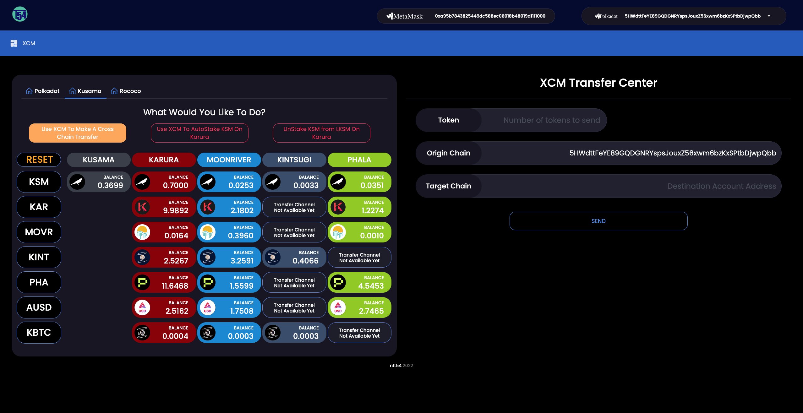
<br>

<br>
<p>
The dashboard on the left part of the screen now unlocks and you are presented with instructions to "Select the Asset To Transfer" 
</p>
<br>

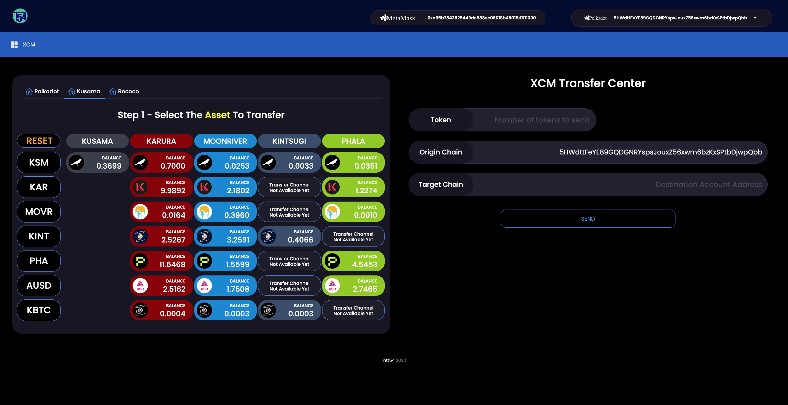
<br>


<p>
Choose an asset from the first column e.g. AUSD. 

This will be highlighted in orange and only the row of that asset will remain visible to emphasize the next available options. 

On the right side of the screen the "Token" field is automatically prefilled with your selection, "AUSD".
</p>
<br>

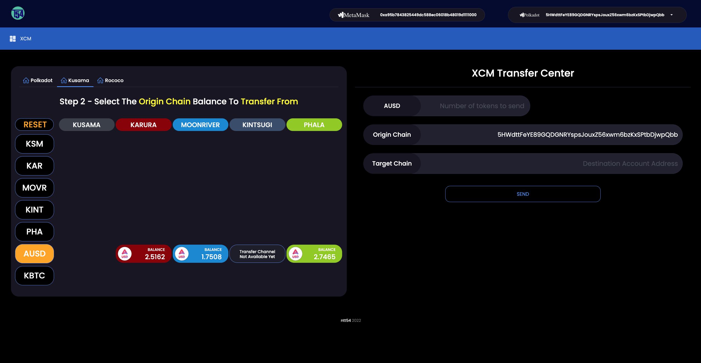

<br>

<p>
Next, select the origin chain that you want to transfer the AUSD "from", for example Karura. This is now also highlighted in orange.

On the right side of the screen:
* The "Origin Chain" field is automatically prefilled with the selection, "Karura".
* The correct address format of the user's substrate account for the chosen origin chain is prefilled. 
* The maximum available balance of the selected asset at the chosen Origin chain is prefilled in the quantity field. The user can of course edit this if they wish to transfer a different amount.

Meanwhile on the left side of the screen, a check is made and the remaining tabs on the row of the selected asset will only remain visible depending on whether the relevant HRMP channel is available or not to transfer the selected asset.
The reason for this is that currently some parachains do not support receiving "secondary" or "non-native" assets. 
<br>
<br>

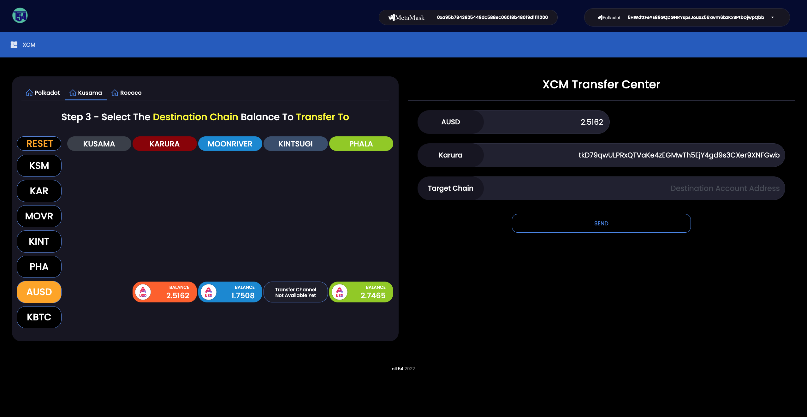
<br>


</p>
<br>

<p>
Next, select the destination chain you want to transfer the AUSD "to", for example, lets choose Phala. This tab is now also highlighted in orange.

On the right side of the screen:
* The "Destination Chain" field is automatically prefilled with the selection, "Phala".
* The correct address format of the user's substrate account for the chosen destination chain is prefilled.
* The user can of course choose to send his asset to any address but as a default this is prefilled with their own address at the destination parachain.
</p>
<br>


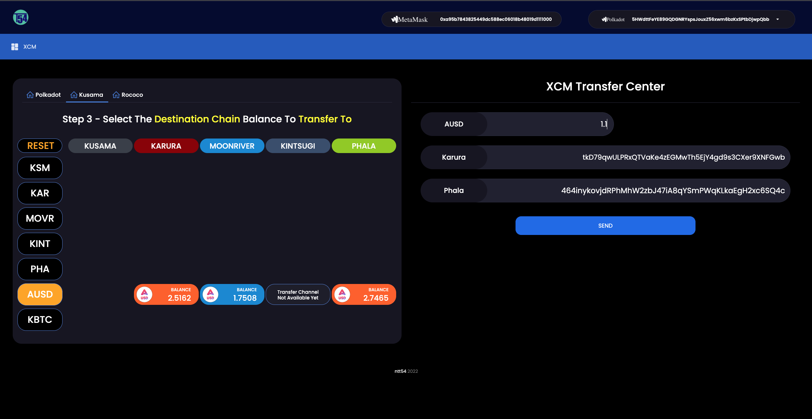
<br>


> TIP:  If the user clicks again or clicks "Reset" the webpage will reset to the intial configuration.


<br>
<p>
That's it! 

Click Send and sign the transaction when the Polkadot Wallet Extension appears.
</p>
<br>

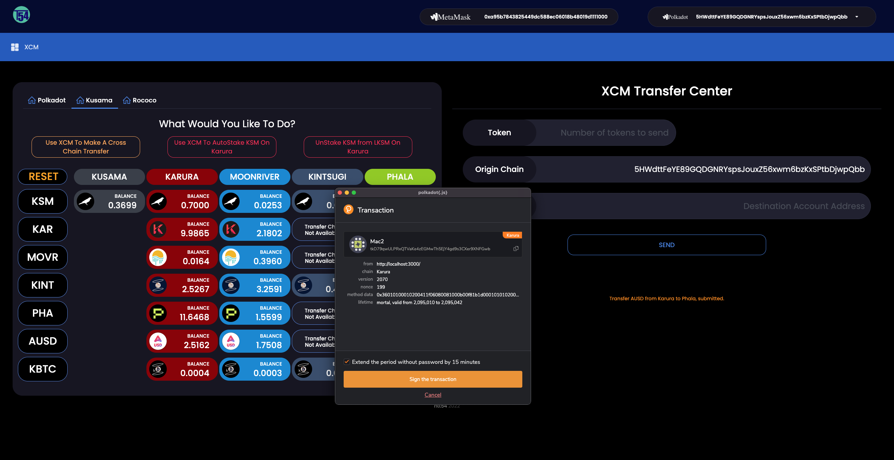
<br>
<br>
The user is immediately notified that the XCM transfer has been submitted.
</p>

<br>
<p>
As soon as the Origin and Destination parachains mine the relevant transactions, the origin chain Extrinsic Hash, Block Hash and XCMP message are displayed on the screen.
</p>
<p>
Lastly, on the left you can see the transfer of assets as the balances on the different parachains are updated.
</p>
<br>

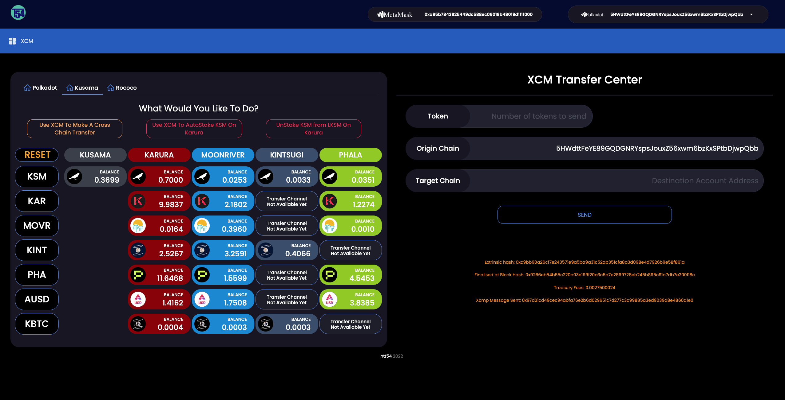
<br>

> TIP: How about making an exotic XCM transfer, like transfering KBTC from Karura to Phala !!!

<br>
<br>

## Use XCM to Autostake KSM on Karura

<p>Next, lets try the Autostake KSM feature using XCM.</p>
<p>
It is possible to transfer KSM using XCM from any of the supported parachains to Karura and then stake it there for LKSM.
</p>
<br>
<p>
Lets see an example of how to transfer KSM from Kusama to Karura and then autostake it for LKSM.
</p>

<p>
Click "Use XCM To Autostake KSM On Karura
</p>
<br>

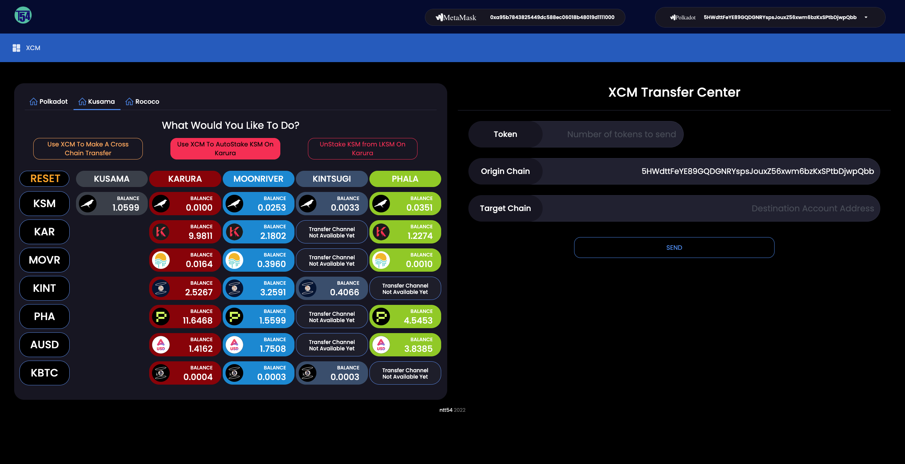
<br>
<br>
<p>
The dashboard on the left side of the screen now unlocks showing only the KSM asset row.

On the right side of the screen the "Token" field is automatically prefilled with your selection, "KSM". 
</p>

<br>

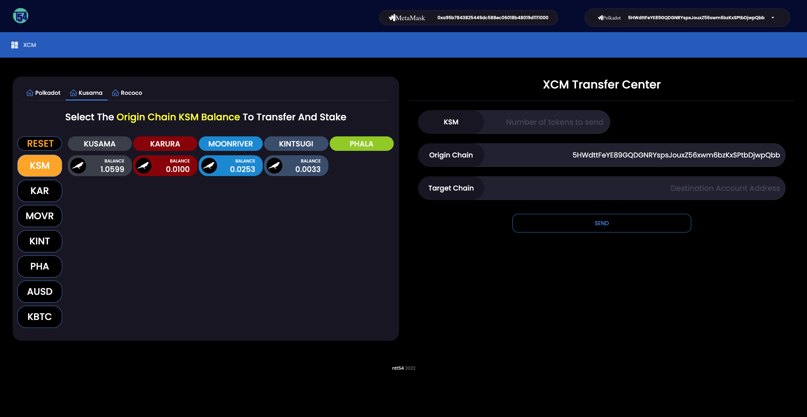
<br>


<p>
The user selects the origin chain that they want to transfer their KSM from,for example Kusama. This is then highlighted in orange.

On the right side of the screen:
* The "Origin Chain" field is automatically prefilled with the selection, "Kusama".
* The correct address format of the user's substrate account for the chosen origin parachain is prefilled. 
* The "Destination Chain" field is automatically prefilled with the selection, "Karura".
* The correct address format of the user's substrate account for the Karura parachain is prefilled.
* The maximum available balance of the selected asset at the chosen Origin chain is also prefilled in the quantity field. 
* The user can of course edit this amount if they prefer to transfer a different amount but it must be noted that the minimum staking quantity for KSM on Karura is 1 KSM plus a small amount to cover the fees, for example 1.01 KSM in total.

<p>
We will transfer 1.01 KSM.
<br>
<br>
</p>

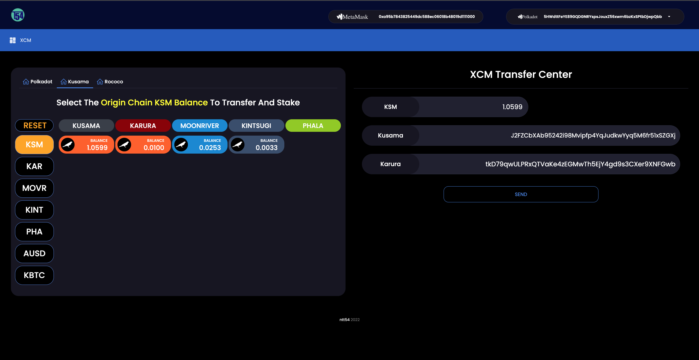
<br>

<br>
<p>
That's it! Click send and sign the two transactions when the Polkadot Wallet Extension appears. 

The first transaction to sign is for the XCM transfer from Kusama.

The second transaction to sign is for staking your KSM at Karura automatically once it arrives at the Karura parachain.
</p>
<br>

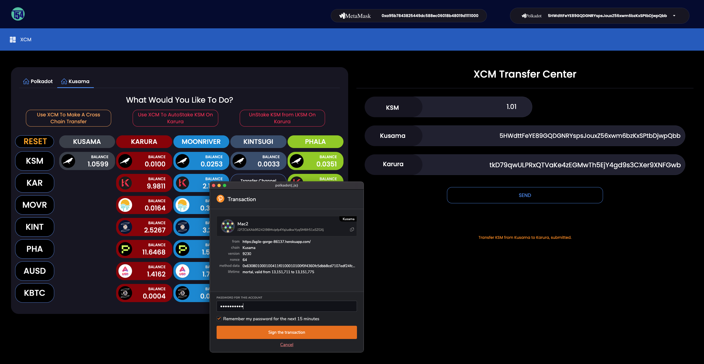
<br>

<br>

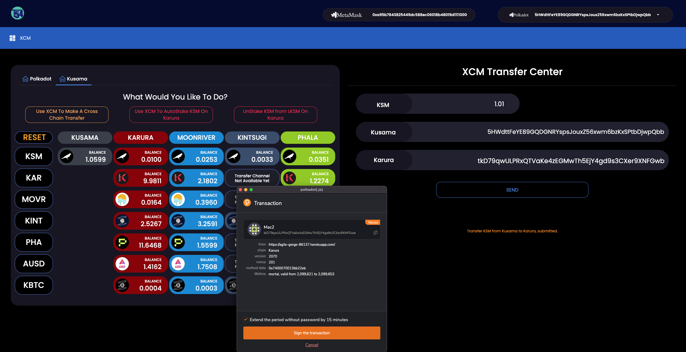
<br>

<br>
<p>
The user is immediately notified that their XCM transfer transaction has been submitted.
</p>

<p>

As soon as the Origin and Destination parachains mine the relevant transactions, the relevant information is displayed:
* XCM Message Hash
* Origin chain Extrinsic Hash
* Block Hash
* Origin Fees
* Destination Fees
* Net Deposited Amount
 
In addition, the Staking KSM Extrinsic Hash at Karura, the Block Hash at Karura and the updated Free LKSM balance are also displayed.
</p>
<p>
Lastly, the balances diplayed on the two parachains are updated on the screen.
</p>
<br>

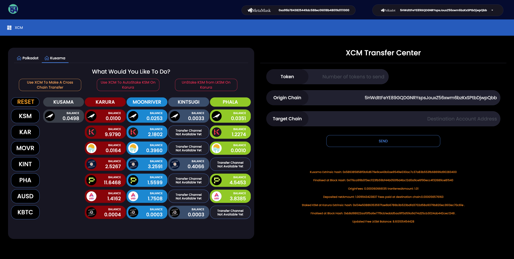
<br>

> TIP: You can try in the same way sending KSM from Moonriver or Kintsugi and staking for LKSM at Karura as well.

<br>
<br>

## Unstake KSM from LKSM on Karura

<p>Now lets see how to unstake KSM from LKSM and so that the free KSM on Karura is available to transfer via XCM.
<p>
Click "UnStake KSM from LKSM On Karura" at the top of the screen.
</p>
<br>

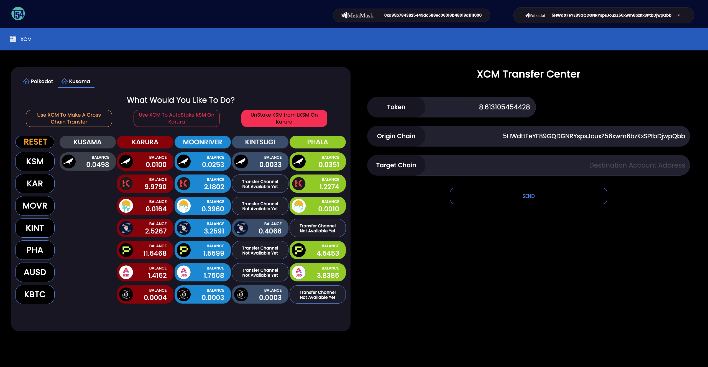
<br>

<p>
The Token field on the right hand side is prefilled with "LKSM=>KSM" and the available balance of LKSM to unstake is also prefilled. 

The Origin and Destination chains are prefilled with Karura along with the user's account in the Karura address format.
</p>

<br>

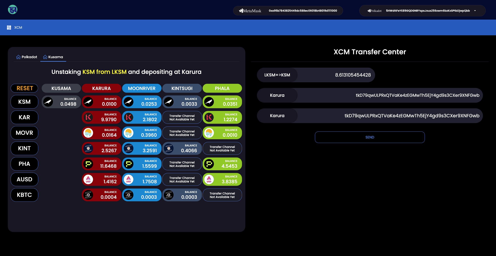
<br>

<p>
That's it! Click send and sign the transaction.
</p>

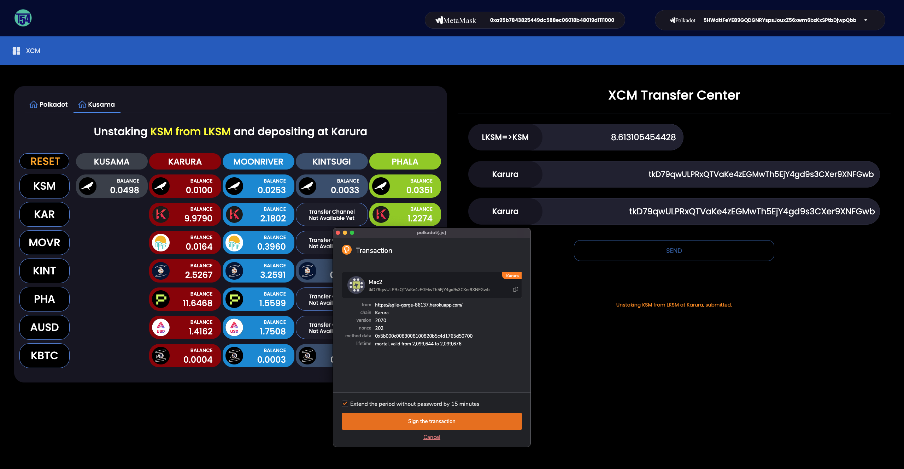
<br>

<p>
Once the Karura parachain mines the unstaking transaction, the Extrinsic Hash, Block Hash and updated LKSM balance is displayed on the screen.
</p>
<p>
Lastly, the balances displayed are updated to reflect the changes. 
</p>
<br>

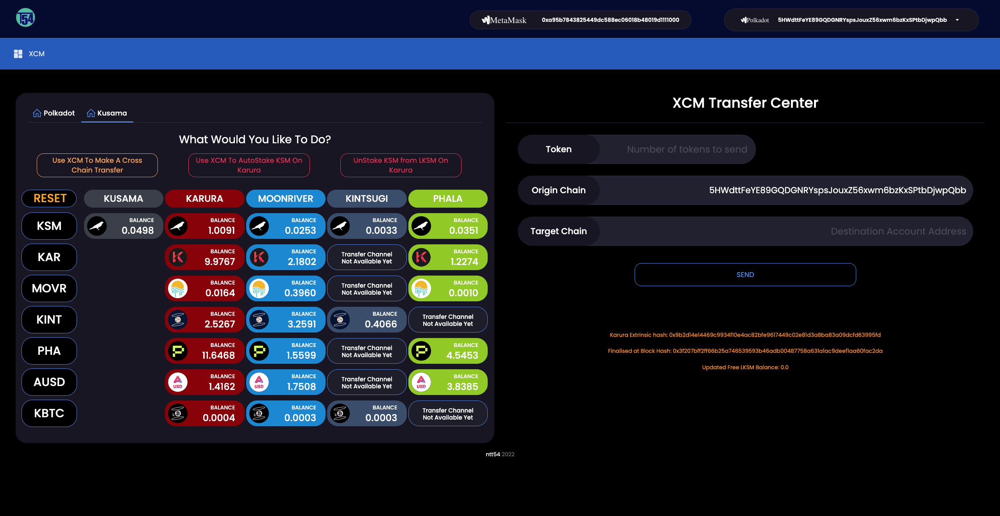
<br>


